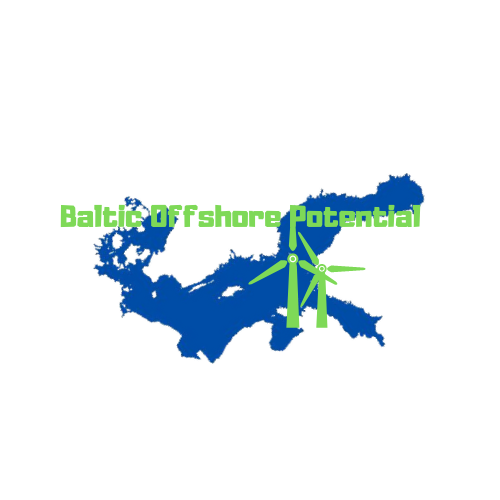

[![Contributors][contributors-shield]][contributors-url]
[![Forks][forks-shield]][forks-url]
[![Stargazers][stars-shield]][stars-url]
[![Issues][issues-shield]][issues-url]
[![MIT License][license-shield]][license-url]
[![LinkedIn][linkedin-shield]][linkedin-url]

<!-- PROJECT LOGO -->
<br />
<p align="center">
  <a href="https://github.com/Piotr296/BalticOffshorePotential">
    
  </a>

  <h3 align="center">Baltic Offshore Potential</h3>

  <p align="center">
    WebGIS application with built-in multi-criteria decision support system
    <br />
    <br />
    <a href="https://baltic-offshore.herokuapp.com/">View Demo</a>
    ·
    <a href="https://github.com/Piotr296/BalticOffshorePotential/issues">Report Bug</a>
    ·
    <a href="https://github.com/Piotr296/BalticOffshorePotential/issues">Request Feature</a>
  </p>
</p>


<!-- TABLE OF CONTENTS -->
## Table of Contents

* [About the Project](#about-the-project)
  * [Built With](#built-with)
* [Getting Started](#getting-started)
* [Usage](#usage)
* [Roadmap](#roadmap)
* [Contributing](#contributing)
* [License](#license)
* [Contact](#contact)
* [Acknowledgements](#acknowledgements)


<!-- ABOUT THE PROJECT -->
## About The Project

The application was created by Piotr Michalak, Angelina

### Built With
* [Python](https://www.python.org)
* [JavaScript](https://www.javascript.com)
* [HTML](https://www.w3.org)
* [CSS](https://www.w3.org)
* [OpenLayers](https://openlayers.org/)
* [Bootstrap](https://getbootstrap.com)
* [JQuery](https://jquery.com)

<!-- GETTING STARTED -->
## Getting Started

To get a local copy use the following git command
```
git clone https://github.com/Piotr296/BalticOffshorePotential.git
```

<!-- USAGE EXAMPLES -->
## Usage

Use this space to show useful examples of how a project can be used. Additional screenshots, code examples and demos work well in this space. You may also link to more resources.


<!-- ROADMAP -->
## Roadmap

See the [open issues](https://github.com/Piotr296/BalticOffshorePotential/issues) for a list of proposed features (and known issues).


<!-- CONTRIBUTING -->
## Contributing

Contributions are what make the open source community such an amazing place to be learn, inspire, and create. Any contributions you make are **greatly appreciated**.

1. Fork the Project
2. Create your Feature Branch (`git checkout -b feature/AmazingFeature`)
3. Commit your Changes (`git commit -m 'Add some AmazingFeature'`)
4. Push to the Branch (`git push origin feature/AmazingFeature`)
5. Open a Pull Request

<!-- LICENSE -->
## License

Distributed under the MIT License. See `LICENSE` for more information.


<!-- CONTACT -->
## Contact
Piotr Michalak - https://www.linkedin.com/in/michalak-gis - pmicha19@student.aau.dk

Project Link: https://github.com/Piotr296/BalticOffshorePotential


<!-- MARKDOWN LINKS & IMAGES -->
<!-- https://www.markdownguide.org/basic-syntax/#reference-style-links -->
[contributors-shield]: https://img.shields.io/github/contributors/Piotr296/BalticOffshorePotential
[contributors-url]: https://github.com/othneildrew/Best-README-Template/graphs/contributors
[forks-shield]: https://img.shields.io/github/forks/Piotr296/BalticOffshorePotential
[forks-url]: https://github.com/Piotr296/BalticOffshorePotential/network/members
[stars-shield]: https://img.shields.io/github/stars/Piotr296/BalticOffshorePotential
[stars-url]: https://github.com/Piotr296/BalticOffshorePotential/stargazers
[issues-shield]: https://img.shields.io/github/issues/Piotr296/BalticOffshorePotential
[issues-url]: https://github.com/Piotr296/BalticOffshorePotential/issues
[license-shield]: https://img.shields.io/github/license/Piotr296/BalticOffshorePotential
[license-url]: https://github.com/Piotr296/BalticOffshorePotential/blob/master/LICENSE.txt
[linkedin-shield]: https://img.shields.io/badge/-LinkedIn-black.svg?style=flat-square&logo=linkedin&colorB=555
[linkedin-url]: https://www.linkedin.com/in/michalak-gis/
[product-screenshot]: images/screenshot.png
